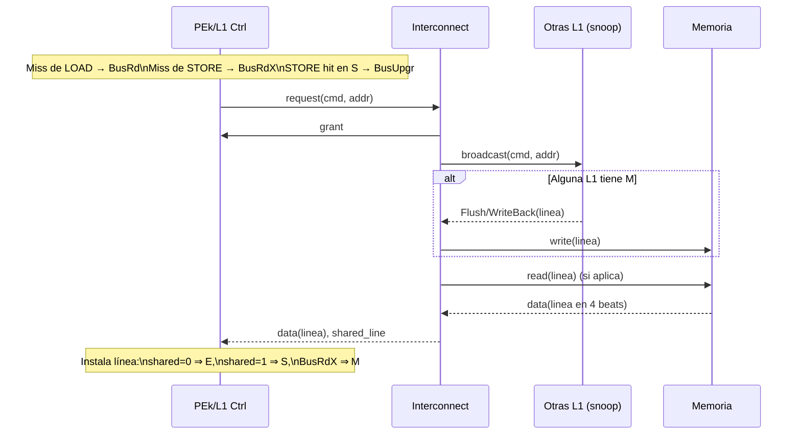

# arqui_II_proyecto_I

# Proyecto I — Diagrama del Sistema (detalle de tamaños, conexiones y ubicación de MESI)

Este archivo aporta un diagrama completo con:
- Dónde reside el controlador MESI en cada PE.
- Tamaños de registros, caché, memoria.
- Anchos del bus (dirección/datos/control) y cómo se conectan los bloques.
- Organización interna de la caché (2-way SA), y desglose Tag/Índice/Offset.

> Nota: Los diagramas están hechos en Mermaid para que los puedas versionar. Si prefieres draw.io/diagrams.net, al final dejo una guía de cómo mapear cada bloque a shapes equivalentes.

---

## 1) Diagrama de alto nivel (4 PEs, bus con snoop y memoria compartida)

```mermaid
flowchart TB
  %% Estilo general
  classDef pe fill:#eef7ff,stroke:#6ca0dc,stroke-width:1px;
  classDef bus fill:#fff7e6,stroke:#e0a100,stroke-width:1px;
  classDef mem fill:#f0fff0,stroke:#55a868,stroke-width:1px;
  classDef ctrl fill:#fff,stroke:#6ca0dc,stroke-dasharray: 3 3;

  %% PE0
  subgraph PE0[PE0]
    direction TB
    R0[RegFile\n(8 × 64 bits)]
    CORE0[PE Core\n(Decoder/ISA + FPU + LSU)]
    subgraph C0[L1 Cache 2-way SA\n16 líneas × 32 B = 512 B]
      direction TB
      DATA0[Data Array\n(8 sets × 2 vías × 32 B)]
      TAG0[Tag/State Array\nTag:4 b, MESI:2 b]
      LRU0[LRU por set\n(1 bit/set)]
    end
    CTRL0:::ctrl[Cache Controller\n+ MESI FSM + Snoop]
    R0 --> CORE0
    CORE0 -- "64-bit load/store" --> CTRL0
    CTRL0 <--> C0
  end
  class PE0 pe

  %% PE1
  subgraph PE1[PE1]
    direction TB
    R1[RegFile\n(8 × 64 bits)]
    CORE1[PE Core\n(Decoder/ISA + FPU + LSU)]
    subgraph C1[L1 Cache 2-way SA\n512 B]
      DATA1[Data Array]
      TAG1[Tag/State Array]
      LRU1[LRU (1 bit/set)]
    end
    CTRL1:::ctrl[Cache Controller\n+ MESI FSM + Snoop]
    R1 --> CORE1
    CORE1 --> CTRL1
    CTRL1 <--> C1
  end
  class PE1 pe

  %% PE2
  subgraph PE2[PE2]
    direction TB
    R2[RegFile\n(8 × 64 bits)]
    CORE2[PE Core\n(Decoder/ISA + FPU + LSU)]
    subgraph C2[L1 Cache 2-way SA\n512 B]
      DATA2[Data Array]
      TAG2[Tag/State Array]
      LRU2[LRU (1 bit/set)]
    end
    CTRL2:::ctrl[Cache Controller\n+ MESI FSM + Snoop]
    R2 --> CORE2
    CORE2 --> CTRL2
    CTRL2 <--> C2
  end
  class PE2 pe

  %% PE3
  subgraph PE3[PE3]
    direction TB
    R3[RegFile\n(8 × 64 bits)]
    CORE3[PE Core\n(Decoder/ISA + FPU + LSU)]
    subgraph C3[L1 Cache 2-way SA\n512 B]
      DATA3[Data Array]
      TAG3[Tag/State Array]
      LRU3[LRU (1 bit/set)]
    end
    CTRL3:::ctrl[Cache Controller\n+ MESI FSM + Snoop]
    R3 --> CORE3
    CORE3 --> CTRL3
    CTRL3 <--> C3
  end
  class PE3 pe

  %% Interconnect / Bus
  subgraph BUS[Interconnect / Shared Bus]
    direction TB
    ARB[Arbiter (Round-Robin)]
    BRC[Broadcaster + Shared-line OR]
    WBQ[Writeback Path]
  end
  class BUS bus

  %% Conexiones PE<->Bus con etiquetas de anchura
  CTRL0 -- "addr[11:0], data[63:0]\ncmd[2:0], shared, req/grant\nburst: 4 beats/linea" --> BUS
  CTRL1 -- "addr[11:0], data[63:0]\ncmd[2:0], shared, req/grant\nburst: 4 beats/linea" --> BUS
  CTRL2 -- "addr[11:0], data[63:0]\ncmd[2:0], shared, req/grant\nburst: 4 beats/linea" --> BUS
  CTRL3 -- "addr[11:0], data[63:0]\ncmd[2:0], shared, req/grant\nburst: 4 beats/linea" --> BUS

  %% Memoria
  MEM[Main Memory\n4 KiB (512 × 64 bits)\n64-bit port]
  BUS --> MEM
  class MEM mem
```

Leyenda rápida:
- El controlador MESI está dentro de cada L1 (bloque “Cache Controller + MESI FSM + Snoop”).
- El core nunca toca la memoria directamente: todo pasa por la L1 y su controlador MESI hacia el bus.

---

## 2) Organización interna de la caché y desglose de dirección

```mermaid
flowchart LR
  classDef box fill:#fff,stroke:#6ca0dc,stroke-width:1px;

  ADDR[Dirección física\n12 bits (0x000–0xFFF)]:::box --> T[TAG\n4 bits b[11:8]]:::box
  T --> I[INDEX\n3 bits b[7:5]]:::box
  I --> O[OFFSET\n5 bits b[4:0]]:::box

  subgraph L1[L1 por PE — 2-way set associative]
    direction TB
    TAGS[Tag/State Array\npor set: {tag:4b, mesi:2b} × 2 vías]:::box
    DATA[Data Array\n8 sets × 2 vías × 32B = 512B]:::box
    LRU[LRU (1 bit por set)]:::box
  end

  CPU[CPU/LSU\naccesos 64-bit]:::box --> CTRL[Cache Controller\nMESI FSM + Snoop]:::box --> L1
  CTRL -- "BusRd / BusRdX / BusUpgr\nWriteBack/Flush" --> BUS[Bus + Snoop]:::box
  BUS --> MEM[Memoria 4 KiB\npuerto 64-bit]:::box
```

Parámetros numéricos:
- Línea: 32 B → offset = 5 bits.
- 16 líneas totales, 2 vías → 8 sets → index = 3 bits.
- Tag = 12 − 5 − 3 = 4 bits.
- Estado MESI por línea: 2 bits (I/S/E/M). Dirty implícito en M.

---

## 3) Interfaz del Bus (señales abstractas y fases)



Anchuras recomendadas:
- Data bus: 64 bits (1 beat = 8 B). Una línea (32 B) = 4 beats.
- Address bus: 12 bits.
- Control: `cmd[2:0]` = {BusRd, BusRdX, BusUpgr, WriteBack}, `shared` (OR de snoops), `req/grant` por maestro.

---

## 4) Dónde “vive” MESI y qué controla
- Ubicación: “Cache Controller + MESI FSM + Snoop” dentro de cada L1.
- Responsabilidades:
  - Decidir hit/miss, seleccionar víctima (LRU), y si hace falta WriteBack por expulsión.
  - Emitir transacciones al bus (BusRd, BusRdX, BusUpgr, WriteBack).
  - Reaccionar a snoops: invalidar, degradar E→S, o Flush cuando se está en M.
  - Asignar estado final tras el fill (E/S/M) en función de `shared_line` y del comando emitido.

---

## 5) Tabla rápida de tamaños y políticas (para rotular en el diagrama)
- Registros por PE: 8 × 64 bits.
- L1 por PE:
  - 2-way set associative, 16 líneas, 32 B/ línea → 512 B.
  - 8 sets, index=3 bits, offset=5 bits, tag=4 bits.
  - Write-allocate, write-back. Reemplazo LRU (1 bit/set).
  - Estados: MESI (I/S/E/M).
- Memoria principal: 4 KiB (512 × 64-bit).
- Bus compartido:
  - Datos: 64 bits, bursts de 4 beats por línea.
  - Dirección: 12 bits.
  - Control: cmd[2:0], shared, req/grant por PE.
  - Arbitraje: round-robin, 1 transacción a la vez (fase atómica).

---

## 6) Cómo llevar esto a draw.io (diagrams.net)
- Cada PE como un “Group” que contiene:
  - Caja “RegFile (8×64)”.
  - Caja “PE Core (ISA/FPU/LSU)”.
  - Grupo “L1 Cache 2-way 512B” con tres cajas internas: Data Array, Tag/State Array, LRU.
  - Caja punteada “Cache Controller + MESI FSM + Snoop”.
- Conecta “Core → Cache Controller → L1” con flechas sólidas.
- Conecta “Cache Controller → Interconnect” con una flecha etiquetada: “addr[11:0], data[63:0], cmd[2:0], shared, req/grant, burst 4”.
- Interconnect: un rectángulo grande con 3 subcajas pequeñas: “Arbiter”, “Broadcaster/Shared-OR”, “Writeback”.
- Conecta Interconnect a “Main Memory (4 KiB)” con flecha “data[63:0]”.

Sugerencias de rotulado para tu imagen actual:
- En cada columna (PE): arriba “RegFile (8×64)”; centro “PEk”; debajo “Cache L1 2-way 512B (16×32B)”; entre “PEk” y “L1” añade el bloque “Cache Controller + MESI FSM + Snoop”.
- Debajo del Interconnect, anota “addr=12b, data=64b, burst=4 beats/linea, cmd={BusRd,BusRdX,BusUpgr,WB}”.
- En Memoria: “4 KiB, 64-bit port”.

---
